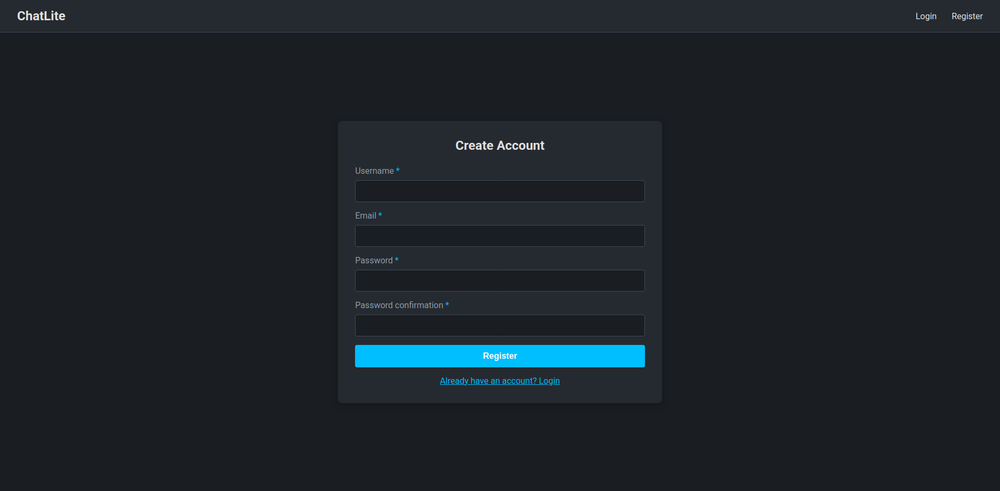
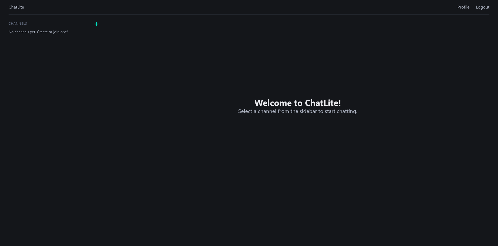
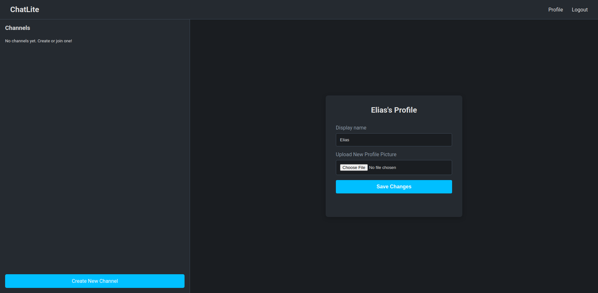
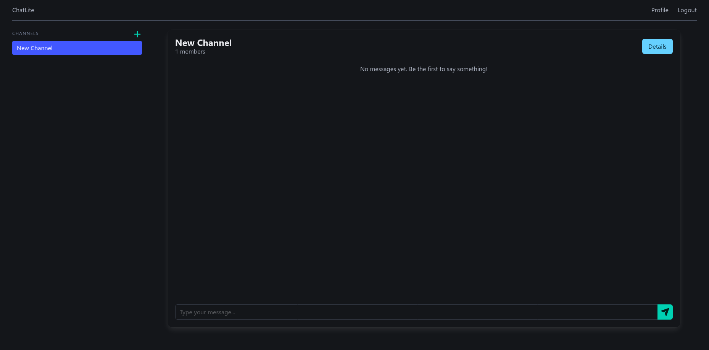

# ChatLite

## Project Goals and Intentions

This document outlines the goals, intentions, and requirements for the ChatLite project. The project aims to create a lightweight, real-time chat web application.

## Architecture Diagram

Here's a high-level overview of the ChatLite application's architecture:

## Folder Structure

The project will follow a standard Django project layout.

- **`/chatlite`**: The main project directory.
  - **`settings.py`**: The main project settings.
  - **`urls.py`**: The main project URL configuration.
  - **`asgi.py`**: ASGI entrypoint for Channels.
  - **`wsgi.py`**: WSGI entrypoint for the web server.
- **`/chats`**: The chat and messaging application directory.
- **`/users`**: The user authentication application directory.
- **`/ui`**: The main directory containing HTML and CSS files.
  - **`/templates`**: Contains Django HTML + HTMX templates.
  - **`/static`**: Contains CSS files for website styling, also contains default images.
- **`/manage.py`**: The Django command-line utility.
- **`/docker-compose.yml`**: Defines the multi-container Docker application.
- **`/Dockerfile`**: Contains the instructions to build the Django application into a Docker image.
- **`/entrypoint.sh`**: A shell script to run migrations before starting the server.
- **`requirements.txt`**: The Python dependencies for the project.

## Core Features

ChatLite offers a comprehensive set of features designed for a seamless real-time chat experience:

- **User Authentication:** Secure sign-up, login, and logout functionalities to manage user access.
- **User Profiles:** Personalized profiles allowing users to set a display name and upload a profile picture, stored on Cloudinary.
- **Channel Management:**
  - **Creation:** Authenticated users can easily create new group channels.
  - **Invite System:** Each channel generates a unique, shareable invite link for easy access.
  - **Admin Control:** Only the channel creator has the authority to modify channel details.
- **Channel Joining:** Users can join channels using a provided invite link.
- **Real-Time Messaging:** Engage in instant conversations with real-time message sending and receiving, eliminating the need for page reloads.
- **Emoji Reactions:** Express yourself with emoji reactions to messages, visible in real-time to all channel members.

## Screenshots

<table style="width:100%; border-collapse: collapse;">
  <tr>
    <td style="border: 1px solid #ddd; padding: 10px; text-align: center;">
      
      
Register Page

    </td>
    <td style="border: 1px solid #ddd; padding: 10px; text-align: center;">
      
      
Home Page

    </td>
  </tr>
  <tr>
    <td style="border: 1px solid #ddd; padding: 10px; text-align: center;">
      
      
Profile Page

    </td>
    <td style="border: 1px solid #ddd; padding: 10px; text-align: center;">
      
      
Chat Page

    </td>
  </tr>
</table>
