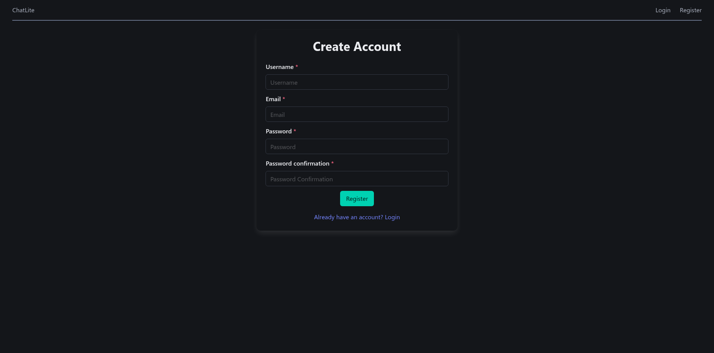
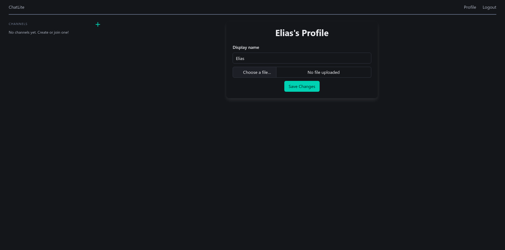

# ChatLite

## Project Goals and Intentions

This document outlines the goals, intentions, and requirements for the ChatLite project. The project aims to create a lightweight, real-time chat web application.

## Architecture Diagram

Here's a high-level overview of the ChatLite application's architecture:


## Folder Structure

The project will follow a standard Django project layout.

- **`/chatlite`**: The main project directory.
  - **`settings.py`**: The main project settings.
  - **`urls.py`**: The main project URL configuration.
  - **`asgi.py`**: ASGI entrypoint for Channels.
- **`/chats`**: The chat and messaging application directory.
- **`/users`**: The user authentication application directory.
- **`/ui`**: The main directory containing HTML and CSS files.
  - **`/templates`**: Contains Django HTML + HTMX templates.
  - **`/static`**: Contains CSS files for website styling, also contains default images.
- **`/manage.py`**: The Django command-line utility.
- **`/docker-compose.yml`**: Defines the multi-container Docker application.
- **`/Dockerfile`**: Contains the instructions to build the Django application into a Docker image.
- **`/entrypoint.sh`**: A shell script to run migrations before starting the server.
- **`requirements.txt`**: The Python dependencies for the project.

## Core Features

ChatLite offers a comprehensive set of features designed for a seamless real-time chat experience:

- **User Authentication:** Secure sign-up, login, and logout functionalities to manage user access.
- **User Profiles:** Personalized profiles allowing users to set a display name and upload a profile picture, stored on Cloudinary.
- **Channel Management:**
  - **Creation:** Authenticated users can easily create new group channels.
  - **Invite System:** Each channel generates a unique, shareable invite link for easy access.
  - **Admin Control:** Only the channel creator has the authority to modify channel details.
- **Channel Joining:** Users can join channels using a provided invite link.
- **Real-Time Messaging:** Engage in instant conversations with real-time message sending and receiving, eliminating the need for page reloads.
- **Emoji Reactions:** Express yourself with emoji reactions to messages, visible in real-time to all channel members.

## Technology Decisions

The ChatLite project leverages a modern technology stack to deliver a robust and real-time chat experience. Here’s a summary of the core technologies and the rationale behind their selection:

- **Backend (Django):** Django was chosen for its "batteries-included" philosophy, providing a comprehensive suite of tools for rapid development, including an ORM, authentication, and security features. Its scalability and extensive documentation make it an ideal choice for building the application's foundation.
- **Frontend (HTMX):** HTMX was selected to enhance the user experience by enabling dynamic, real-time updates without complex JavaScript. It allows for seamless interactions, such as real-time messaging and emoji reactions, by making simple AJAX requests, keeping the frontend lightweight and responsive.
- **Database (PostgreSQL):** PostgreSQL is a powerful, open-source relational database known for its reliability and data integrity. It is well-suited for handling the structured data of a chat application, ensuring that messages, user profiles, and channel information are stored securely and efficiently.
- **Real-Time Communication (Django Channels):** To support real-time features like instant messaging and live emoji reactions, Django Channels was integrated. It extends Django to handle WebSockets, allowing for persistent, bidirectional communication between the client and server.
- **In-Memory Data Store (Redis):** Redis serves as the message broker for Django Channels, enabling real-time communication across multiple server instances. While an in-memory backend is suitable for local development, Redis is essential for production environments to ensure WebSocket connections are reliably managed and scaled.
- **Deployment (Render):** Render was chosen for its ease of use and seamless deployment capabilities. It simplifies the process of deploying web applications, managing databases, and scaling services, making it an excellent platform for hosting ChatLite.
- **File Storage (Cloudinary):** For handling user-uploaded profile pictures, Cloudinary was selected. It provides a robust, cloud-based solution for image management, including storage, transformation, and delivery, offloading the complexity of file handling from the application server.
- **Containerization (Docker Compose):** Docker Compose is used to create a consistent and reproducible development environment. It allows the application and its dependencies (like PostgreSQL) to be containerized, ensuring that the development setup is identical for all team members and closely mirrors the production environment.
- **Package Management (uv):** `uv` is utilized for Python package management due to its high performance and modern dependency resolution capabilities. It streamlines the process of installing and managing project dependencies, contributing to a more efficient development workflow.

## Running Locally with Docker

To run ChatLite locally using Docker, follow these steps:

1. **Environment Configuration:**
   Before starting the application, ensure you have configured your environment variables. You can either:
   - Modify the `base.env` file directly in the project root directory.
   - Create an `override.env` file in the project root directory to override specific variables from `base.env`.
     Ensure you fill in the missing values, especially for database and Cloudinary credentials.

2. **Build and Run with Docker Compose:**
   Navigate to the project's root directory in your terminal and execute the following command:

   ```bash
   docker compose up --build
   ```

   This command will build the Docker images and set up the necessary services (web, database).

3. **Access the Application:**
   Once the services are up and running, you can access the ChatLite application in your web browser at:

   ```
   http://localhost:8000
   ```

   It might take a few moments for the database to initialize and the Django application to start completely.

## Screenshots

<table style="width:100%; border-collapse: collapse;">
  <tr>
    <td style="border: 1px solid #ddd; padding: 10px; text-align: center;">
      
      <p style="margin-top: 5px; font-style: italic;">Register Page</p>
    </td>
    <td style="border: 1px solid #ddd; padding: 10px; text-align: center;">
      
      <p style="margin-top: 5px; font-style: italic;">Home Page</p>
    </td>
  </tr>
  <tr>
    <td style="border: 1px solid #ddd; padding: 10px; text-align: center;">
      
      <p style="margin-top: 5px; font-style: italic;">Profile Page</p>
    </td>
    <td style="border: 1px solid #ddd; padding: 10px; text-align: center;">
      
      <p style="margin-top: 5px; font-style: italic;">Chat Page</p>
    </td>
  </tr>
</table>
